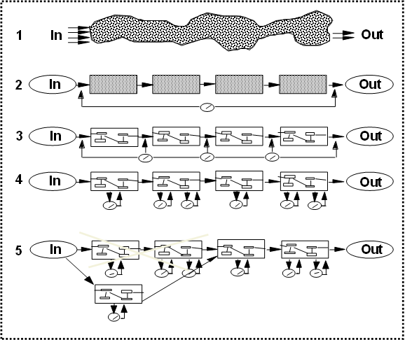

# SZZ injection

## SWI

### Softwarový proces



{% embed data="{\"url\":\"https://cs.wikipedia.org/wiki/Metodika\_vývoje\_softwaru\#Spirálový\_přístup\",\"type\":\"link\",\"title\":\"Metodika vývoje softwaru\",\"description\":\"Metodika vývoje softwaru \(někdy nepřesně označovaná jako „metodologie vývoje softwaru“\) je souhrn postupů, pravidel a nástrojů \(frameworků\) používaný pro návrh, plánování a řízení vývoje software. Metodikou se též rozumí využití takového frameworku nebo dalších specifických postupů pracovním týmem nebo celou organizací při vývoji aplikačního software nebo informačního systému.\",\"icon\":{\"type\":\"icon\",\"url\":\"https://cs.wikipedia.org/static/apple-touch/wikipedia.png\",\"aspectRatio\":0},\"thumbnail\":{\"type\":\"thumbnail\",\"url\":\"//upload.wikimedia.org/wikipedia/commons/thumb/b/b6/Three\_software\_development\_patterns\_mashed\_together\_cz.svg/220px-Three\_software\_development\_patterns\_mashed\_together\_cz.svg.png\",\"width\":220,\"height\":208,\"aspectRatio\":0.9454545454545454}}" %}

Po částech uspořádaná množina kroků vedoucí k dosažení cíle. Cílem je obvykle nějaký software.

**Modely:**

1. **Vodopádový model**
2. **Iterační přístup **- metody RUP \(Rational Unified Process\), prototypový model, spirálový model, ingrementální model, extrémní programování 
3. **Agilní metodiky** - SCRUM
4. **Programování řízené testy**

**Úrovně vyspělosti procesu:**

Pro hodnocení firmy z hlediska schopnosti řídit se procesy je definována stupnice CMM \(Cpability Maturity Model\)

**počáteční **\(initial\) - nejsou definovány skoro žádné procesy, každý projekt je řešen ad-hoc

**opakovaná **\(repeatable\) - v jednotlivých projektech byly nalezeny opakované postupy, které je firma řízeně použít v každém projektu

**definovaná **\(defined\) - softwarový proces je jasně definován a zdokumentován, používají se opakovaně kroky které byli již používány v minulosti

**řízená **\(managed\) -  plně integrovaný softwarový proces, který je firma schopna přizpůsobit požadavkům nového projekty bez ztráty kvality

**optimalizovaná **\(optimalizing\) - vylepšování procesu pro jednotlivé projekty na základě zpětné vazby z předchozích projektů

### Počáteční fáze vývoje



První fází je **specifikace požadavků **cílem je definovat seznam požadavků na software a popsat jeho jednotlivé funkcionality. Výsledkem je dokument, který stanovuje rozsah projektu a stává se základem smlouvy se zákazníkem.

V této fázi se používají **use-case** diagramy pro znázornění entit systému a činností, které vykonávají. **Sekvenční diagram**, který popisuje funkci systému z pohledu objektů a zachycuje jejich vzájemnou komunikaci a interakci v závislosti na čase. **Diagram aktivit** zachycuje rozhodovací proces pro konkrétní funkci systému.

### Fáze návrhu 



V této fázi se vytváří abstraktní náhled na implementaci systému. Definují se entity v systému, jejich vztahy a procesy nad nimi. Výstup fáze návrhu slouží jako vstupní dokument pro implementační tým.

Používají se následující diagramy:

* diagram tříd - statický pohled na třídy systému a jejich vztah
* sekvenční diagram - interakce mezi objekty, závislý na čase
* diagram spolupráce - interakce mezi objekty, nezávislá na čase
* stavový diagram - životní cyklus entit a objektů v systému
* diagram nasazení - popis reálné konfigurace a nasazení systému

### Návrhové vzory

Návrhový vzor je obecně známy postup pro řešení konkrétního problému.

#### Creational patterns \(vytvářecí\) 

zabývají se postupy pro vytváření objektů, řeší jaká třída se použije pro vytvoření instance, v jakém množství bude možné instance vyprodukovat, kdy se mají instance vytvořit, ...

**Abstract Factory **\(Abstraktní továrna\) – Definuje rozhraní pro vytváření rodin objektů, které jsou na sobě závislé nebo spolu nějak souvisí bez určení konkrétní třídy. Klient je odstíněn od vytváření konkrétních instancí objektů.

**Factory Method **\(Tovární metoda\) – Definuje rozhraní pro vytváření objektu, které nechává potomky rozhodnout o tom, jaký objekt bude fakticky vytvořen. \*Tovární metoda nechává třídy přenést vytváření na potomky.

**Builder** \(Stavitel\) – Odděluje tvorbu komplexu objektů od jejich reprezentace tak, aby stejný proces tvorby mohl být použit i pro jiné reprezentace.

**Singleton** \(Jedináček\) – Potřebujete-li, aby měla třída maximálně jednu instanci. Tento návrhový vzor je už trochu zastaralý a měl by se spíše používat návrhový vzor **Dependency injection**
.

**Prototype** \(Prototyp, Klon\) – Specifikuje druh objektů, které se mají vytvořit použitím prototypového objektu. Nové objekty se vytváří kopírováním tohoto prototypového objektu.

**Lazy Initialization** \(Odložená inicializace\) – Odkládá vytváření objektu, počítání hodnoty nebo provádění nějakého procesu, až do okamžiku, kdy je ho poprvé potřeba.

**Object pool** \(Fond, lidově bazén\) – Umožňuje vyhnout se drahému vytváření a uvolňování zdrojů recyklováním objektů, které už se nepoužívají.

#### Structural patterns \(strukturální\)

Řeší uspořádání komponent a objektů, tak aby byl projekt přehlednější a odstiňují vývojáře od komplexní vnitřní implementace

**Adapter **\(Adaptér\) – Potřebujete-li, aby spolu pracovaly dvě třídy, které nemají kompatibilní rozhraní. Adaptér převádí rozhraní jedné třídy na rozhraní druhé třídy.

**Bridge **\(Most\) – Oddělí abstrakci od implementace, tak aby se tyto dvě mohly libovolně lišit.

**Composite **\(Strom, Složenina\) – Komponuje objekty do stromové struktury a umožňuje klientovi pracovat s jednotlivými i se složenými objekty stejným způsobem.

**Decorator **\(Dekorátor\) – Použijeme jej v případě, že máme nějaké objekty, kterým potřebujeme přidávat další funkce za běhu. Nový objekt si zachovává původní rozhraní.

**Facade **\(Fasáda\) – Nabízí jednotné rozhraní k sadě rozhraní v podsystému. Definuje rozhraní vyšší úrovně, které zjednodušuje použití podsystému.

**Flyweight **\(Muší váha\) – Je vhodná pro použití v případě, že máte příliš mnoho malých objektů, které jsou si velmi podobné.

**Proxy **– Nabízí náhradu nebo zástupný objekt za nějaký jiný pro kontrolu přístupu k danému objektu.

#### **Behavioral patterns** \(vzory chování\)

Definuje jak se třídy a objekty budou chovat vůči svému okolí, jaké budou mít vlastnosti a za co budou zodpovědné

**Observer **\(Pozorovatel\) – V případě, kdy je na jednom objektu závislých mnoho dalších objektů, poskytne vám tento vzor způsob, jak všem dát vědět, když se něco změní.

**Command **\(Příkaz\) – Zapouzdřete požadavek jako objekt a tím umožněte parametrizovat klienty s různými požadavky, frontami nebo požadavky na log a podporujte operace, které jdou vzít zpět.

**Interpreter **\(Interpret\) - Vytváří jazyk, což znamená definování gramatických pravidel a určení způsobu, jak vzniklý jazyk interpretovat.

**State **\(Stav\) – Umožňuje objektu měnit své chování, pokud se změní jeho vnitřní stav. Objekt se tváří, jako kdyby se stal instancí jiné třídy.

**Strategy **\(Strategie\) – Zapouzdřuje nějaký druh algoritmů nebo objektů, které se mají měnit, tak aby byly pro klienta zaměnitelné.

**Chain of responsibility **\(Zřetězení zodpovědnosti\) – Řeší jak zaslat požadavek bez přesného vymezení objektu, který jej zpracuje.

**Visitor **\(Návštěvník\) – Reprezentuje operaci, která by měla být provedena na elementech objektové struktury. Visitor vám umožní definovat nové operace beze změny tříd elementů na kterých pracuje.

**Iterator **\(Iterátor\) – Nabízí způsob, jak přistupovat k elementům skupinového objektu postupně bez toho, abyste vystavovali vnitřní reprezentaci tohoto objektu.

**Mediator **\(Prostředník\) – Umožňuje zajistit komunikaci mezi dvěma komponentami programu, aniž by byly v přímé interakci a tím musely přesně znát poskytované metody.

**Memento **\(Memento\) – Bez porušování zapouzdření zachyťte a uložte do externího objektu interní stav objektu tak, aby ten objekt mohl být do tohoto stavu kdykoliv později vrácen.

**Template method** \(Šablonová metoda\) – Definuje kostru toho, jak nějaký algoritmus funguje, s tím, že některé kroky nechává na potomcích. Umožňuje tak potomkům upravit určité kroky algoritmu bez toho, aby mohli měnit strukturu algoritmu.

> První formální definice návrhových vzorů byla definována v knize  **Design Patterns: Elements of Reusable Object-Oriented Software**, kde kromě 23 základních návrhových vzorů byly popsány základní pilíře objektově orientovaného programování. Tyto původní návrhové vzory jsou označovány jako **GoF** podle 4 autorů knihy \(Gang of Four\).

### OOP

* Je vedeno snahou o znovupoužitelnost komponent
* komplexní problém se rozloží na dílčí problémy které lze řešit samostatně
* struktura programu se snaží kopírovat reálné prostředí - navzájem komunikující objekty
* snaží se krýt detaily implementace před ostatními entitami

#### Třída

Slouží jako šablona pro vytváření objektů, nenese informace o konkrétním objektu pouze definuje strukturu a chování objektu. Může mít implementovány také vlastní třídní proměnné a metody.

#### Objekt

Je instancí třídy, má své vlastní vlastnosti \(proměnné\) a chování \(metody\).

#### Interface

Třídě, která používá interface předepisuje metody a proměnné, které musí tato třída implementovat. Samotný interface obsahuje pouze deklarace metod a proměnných, neobsahuje žádné definice. Třída může implementovat více různých rozhraní.

#### Abstraktní třída

Tento typ třídy může obsahovat implementaci metod i pouze deklarované metody bez implementace. Stejně jako u rozhraní nelze vytvořit instanci abstraktní třídy. Třída může podědit pouze z jedné abstraktní třídy.

